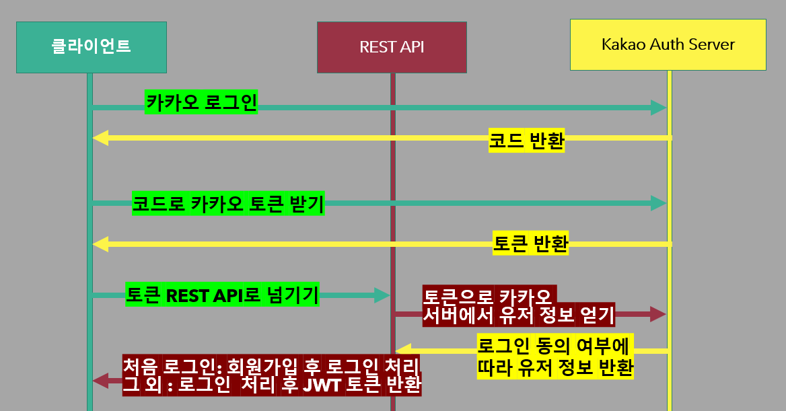
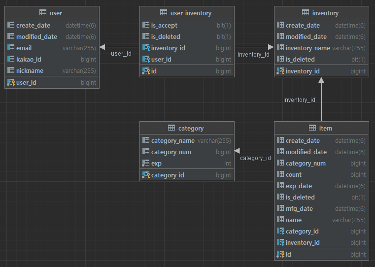

# EasySobi-Server
 

## Info 

헷갈리기 쉬운 소비기한 관리 서비스

## 소비기한이란?
기존 식품의 판매 허용 기한인 유통기한은 영업자 중심의 기한이었습니다.
하지만 소비기한은 보관 방법 준수 시 안전하게 섭취 가능한
기한을 알려주는 소비자 중심의 기한 표시제입니다.
대게 유통기한 <= 소비기한인 것입니다.

## 기대
소비기한 계산 및 식품 관리 기능으로 우리가 먹는
식품 안전성 증가 및 음식물 쓰레기 감소를 기대할 수 있습니다.

## Kakao REST API Auth

## ERD

## Tech Stack

- JDK-17
- Spring Boot-3.0.4
- MySQL
- AWS EC2
- Redis
